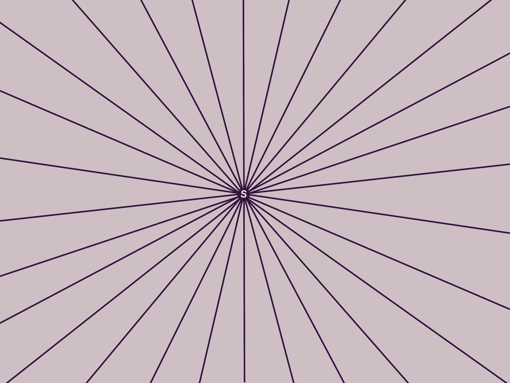

This is a post about being stupid (or, not being, rather).

Some time ago, I used to feel envious when I saw people succeed where I failed (or where I had never even been). When I was just learning to code, I felt that, seeing people get jobs at awesome companies and salaries 20x higher than mine (I was a teacher of English as second language). When I got my first job, I felt that, talking to my teammates and barely even understanding many things they were confident with. When I became more experienced, I felt that, knowing that it could take lifetime to reach experts. But wait, they have the same time to go even further. Can I reach them at all?

👇 [**TL;DR**](#tldr)

If you ever feel the same, I hope this article will help.

It is not about waiting, practicing, or magic numbers of hours of effort. These are all good, but they don't motivate a lot if you think a bit (in a wrong direction, but still). Chances are, that when you hit the cherished 10k hours of experience, the person you were inspired by will have what they had + the 10k hours that passed. This race might seem unfair, but I don't even see the point in discussing this race. Instead, I'd like to share my vision of being **intelligent** vs being **stupid** and I hope it will help as it did to me.

## The Pillars

The concept I'd like to describe is built atop two main ideas:

1. Many things in our world are not finite. You cannot finish **becoming an artist**, **learning mathematics** or **gaining expertise in coding**. Moreover, there aren't any areas completely studied by humanity and made available as a 101 for every person on the planet. [^1] Thus, there is always something further away. This also makes it difficult to identify where you are on the line when it's in fact `a ray, starting at being "stupid"`.
2. Being "stupid" is in fact the same, no matter what exact area we talk about. As the word implies, when we are stupid, we are stupid at everything. So, `all the rays start at the same point`.

## The Star

With these, we can represent potential knowledge as a star with countless rays moving directions from the **stupidity point**.



## The Exercise

You can create one of yours, name the rays with different things you are good (or bad) at, put dots representing your place on the ray, and then join them with lines. The units can be relative to whatever you like - your personal feelings, comparison with other people having knowledge on the same ray, comparison with dots on other rays - it doesn't really matter.

If you finished the exercise - this is the visual representation of the knowledge you possess.

> What is outside your knowledge does not make you stupid. Being "stupid" is just the dot where all the rays start.

## The Idea

The main idea here is that it doesn't really matter where you are. It also doesn't matter where the person you compare yourself to is. Each of the rays is in fact infinite. It is **_just a matter of scale_**. You can keep zooming out, making the rays longer and longer on the visible canvas, but they won't end.

You can take your map and put a map of the person you envy atop. The difference might look significant, but you can zoom out and at some point it will not be visible at all. Just because there is always more, even if you take the brightest minds ever lived.

## The Conclusion

This is not breathtaking, but this idea helped me to stop being distracted by useless thoughts. Friendly envy is OK. Any envy is OK, unless it takes over you. If it does, I hope this post will help you.

## What's Next

If you create a map like this, [tweet it at me](https://twitter.com/intent/tweet?related=orlovedev&text=Hey!%20I%20made%20a%20star!). I would be happy to see it.

## TL;DR

```markdown
- **Nobody** is stupid.
- Draw stuff, it helps a lot.
```

[^1]: Or, at least, I haven't heard of it.
